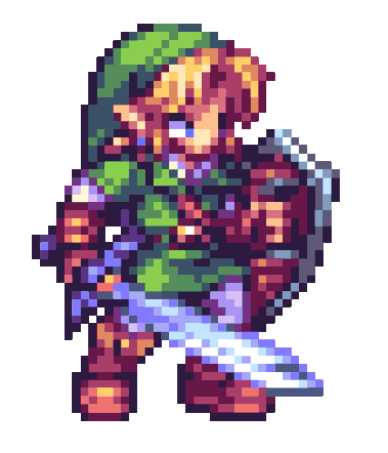

<h1>
  I'm Stan1ey
  
</h1>

<table>
<tr>
<td width="45%" valign="top">

### About me

- 🌱 I’m currently learning AI Agents / LLM
- 🧑‍💻 I enjoy building useful open-source projects
- 💬 Ask me about Python, AI, Web, and automation
- 📫 How to reach me: shen_shifan@qq.com
- 📍 Based in Shanghai, China

  

  
  &nbsp;&nbsp;
  
  &nbsp;&nbsp;
  
  &nbsp;&nbsp;
  

</td>
<td width="55%" valign="top">

 

<!-- CODE-STATS:START -->

<!-- CODE-STATS:END -->

</td>
</tr>
<tr>
<td colspan="2" valign="top" align="center">

</td>
</tr>
</table>
